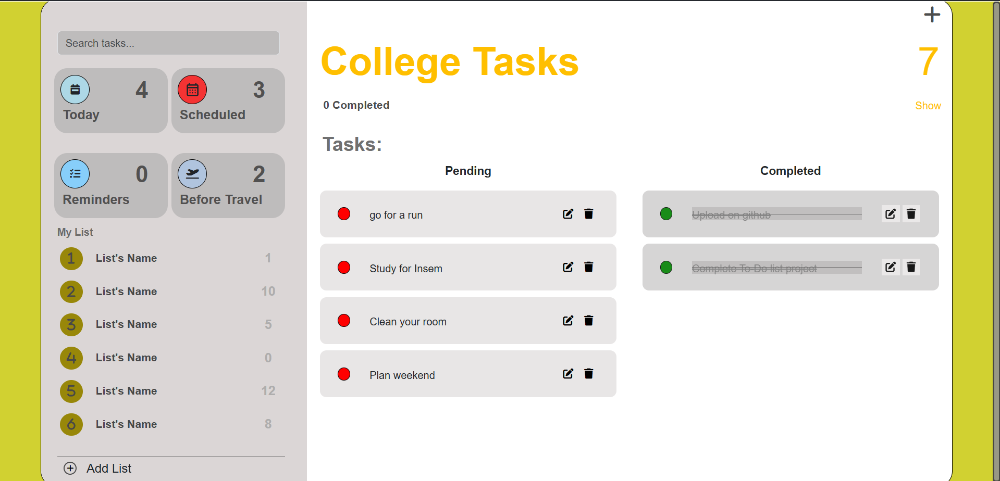

# 📌 To-Do List Web App 🚀

Welcome to the **To-Do List Web App**! ✅ This feature-rich task manager helps you stay on top of your daily activities by keeping track of your tasks efficiently. Whether you need to manage work assignments, personal goals, or household chores, this app ensures nothing slips through the cracks! 📝💡

---

## ✨ Key Features

🔹 **🆕 Add & Remove Tasks** – Easily add new tasks with just a click and remove them when completed. No hassle, no clutter!  
🔹 **✏️ Edit Tasks** – Need to make changes? Modify existing tasks instantly.  
🔹 **📂 Organize with Lists** – Create multiple lists to categorize your tasks efficiently. Group work, personal, or grocery lists separately!  
🔹 **⏳ Task Status Tracking** – Stay informed with clear sections for **pending** and **completed** tasks.  
🔹 **✅ Visual Indicators** – Completed tasks are displayed with a **green checkmark** and a ~~strikethrough~~ effect for clear distinction.  
🔹 **🎯 User-Friendly Interface** – A clean, responsive, and intuitive design makes navigation effortless. Works seamlessly on all devices!  

---

## 🛠 Tech Stack

Our app is built using modern web technologies to ensure smooth performance and an engaging user experience:

- **HTML** 🏗️ – Provides the structure of the application.
- **CSS** 🎨 – Enhances the visual appeal with styles and effects.
- **Bootstrap** 🚀 – Ensures responsiveness and a sleek design.
- **JavaScript** 🧠 – Powers dynamic interactions and task management.

---

## 📸 Screenshots

Here’s a glimpse of the interface in action:

---

## 🚀 How to Use

1️⃣ **Open the web app** in your preferred browser.  
2️⃣ **Add tasks** by entering them in the input field and pressing the add button.  
3️⃣ **Categorize tasks** by creating custom lists for better organization.  
4️⃣ **Edit or delete tasks** anytime to keep your to-do list up to date.  
5️⃣ **Mark tasks as completed** to move them to the done section, where they will be displayed with a ✅ and ~~strikethrough~~ effect.  
6️⃣ **Stay organized and productive** with this efficient task manager! 🎯

---

## 🔮 Future Enhancements

🚀 **Dark Mode Support** – A sleek dark theme for late-night productivity 🌙  
🚀 **Drag-and-Drop Functionality** – Rearrange tasks easily with a simple drag-and-drop action 🔀  
🚀 **Reminders & Notifications** – Get timely alerts for important tasks 🔔  
🚀 **Cloud Storage Integration** – Sync your tasks across multiple devices ☁️  

---

### 🎉 Thank You for Checking Out This Project! 
I hope this tool helps you stay on track and boost your productivity. If you have any suggestions or feedback, feel free to share! 🚀😊

